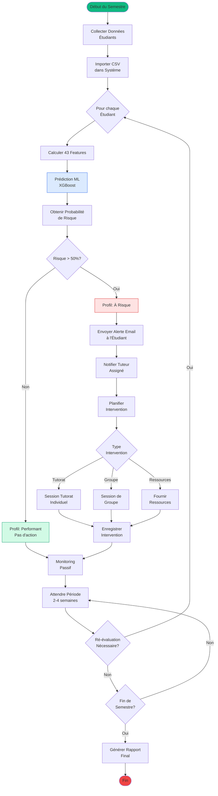
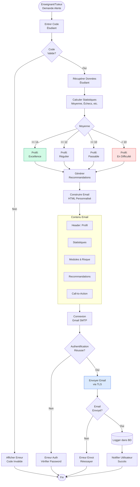
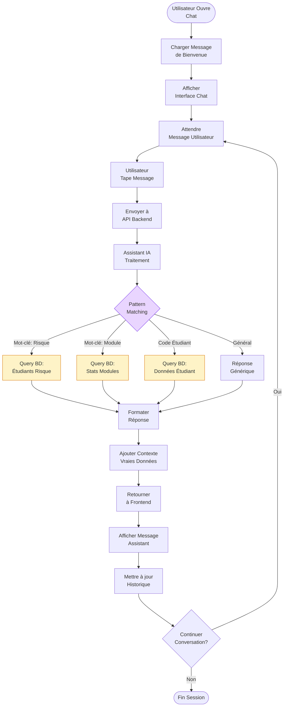

# Diagrammes d'Activité - Flux de Travail

## Vue d'ensemble

Ces diagrammes illustrent les processus métier et les flux de travail du système.

---

## 1. Processus Complet de Soutien Pédagogique

---

## 2. Flux de Prédiction ML Détaillé

```mermaid
flowchart LR
    Start([Requête<br/>Prédiction])
    
    Start --> GetStudent[Récupérer<br/>Historique Étudiant]
    GetStudent --> CheckData{Données<br/>Suffisantes?}
    
    CheckData -->|Non| Error[Erreur: Données<br/>Insuffisantes]
    CheckData -->|Oui| ExtractFeatures
    
    subgraph "Feature Engineering"
        ExtractFeatures[Extraire Features<br/>Numériques]
        ExtractFeatures --> CalcPerf[Calculer Performance<br/>Étudiant]
        CalcPerf --> CalcModule[Statistiques<br/>Module]
        CalcModule --> Compare[Comparaison<br/>avec Pairs]
        Compare --> BuildVector[Construire Vecteur<br/>43 Features]
    end
    
    BuildVector --> Normalize[Normalisation<br/>StandardScaler]
    
    subgraph "ML Prediction"
        Normalize --> XGB[XGBoost<br/>Predict]
        XGB --> Calibrate[Calibration<br/>Probabilités]
        Calibrate --> Cluster[K-Means<br/>Profil]
    end
    
    Cluster --> FormatResult[Formater<br/>Résultat]
    FormatResult --> SaveDB[(Sauvegarder<br/>en BD)]
    
    SaveDB --> Return([Retourner<br/>Prédiction])
    Error --> Return
    
    style ExtractFeatures fill:#FEF3C7
    style CalcPerf fill:#FEF3C7
    style CalcModule fill:#FEF3C7
    style Compare fill:#FEF3C7
    style BuildVector fill:#FEF3C7
    style XGB fill:#DBEAFE
    style Calibrate fill:#DBEAFE
    style Cluster fill:#DBEAFE
```

---

## 3. Processus d'Envoi d'Alerte Email

---

## 4. Utilisation de l'Assistant IA

---

## Notation

### Symboles Utilisés

- **Rectangle** : Action/Processus
- **Losange** : Décision/Condition
- **Cylindre** : Base de données
- **Cercle début/fin** : Début/Fin du processus
- **Sous-graphe** : Groupe de processus liés

### Code Couleur

- 🟢 Vert : Succès, Début
- 🔴 Rouge : Erreur, Fin
- 🔵 Bleu : Calcul ML
- 🟡 Jaune : Feature Engineering
- 🟣 Violet : Intelligence

---

**Note:** Ces diagrammes peuvent être visualisés sur https://mermaid.live
