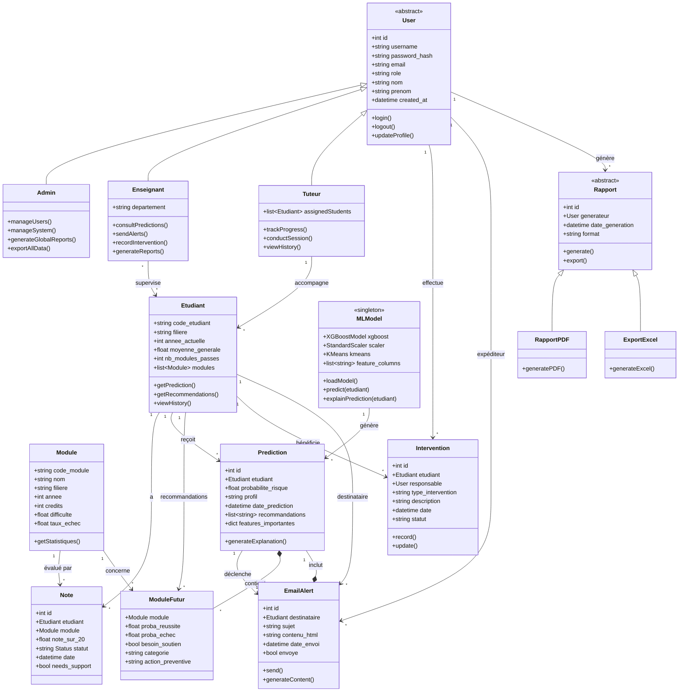

# Diagramme de Classes - Système de Soutien Pédagogique

## Vue d'ensemble

Ce diagramme représente l'architecture orientée objet du système avec les classes principales et leurs relations.

## Diagramme

## Description des Classes Principales

### 👤 User (Classe Abstraite)
**Responsabilité:** Gestion de l'authentification et profil utilisateur de base  
**Attributs clés:**
- `role` : admin, enseignant, tuteur
- `password_hash` : Stockage sécurisé du mot de passe

**Sous-classes:** Admin, Enseignant, Tuteur

### 👨‍🎓 Etudiant
**Responsabilité:** Représente un étudiant avec son parcours académique  
**Attributs clés:**
- `code_etudiant` : Identifiant unique
- `moyenne_generale` : Performance globale
- `modules` : Liste des modules suivis

**Méthodes:** `getPrediction()`, `getRecommendations()`

### 📚 Module
**Responsabilité:** Représente un cours/module académique  
**Attributs clés:**
- `difficulte` : Niveau de difficulté calculé
- `taux_echec` : Statistique historique

**Méthodes:** `getStatistiques()` - Calcule taux de réussite, moyenne, etc.

### 🤖 MLModel (Singleton)
**Responsabilité:** Gestion du modèle de Machine Learning  
**Pattern:** Singleton (une seule instance)  
**Attributs clés:**
- `xgboost` : Modèle XGBoost entraîné
- `scaler` : StandardScaler pour normalisation
- `feature_columns` : 43 features utilisées

**Méthodes:**
- `predict()` : Génère une prédiction
- `explainPrediction()` : Utilise SHAP/LIME

### 🔮 Prediction
**Responsabilité:** Stocke le résultat d'une prédiction ML  
**Attributs clés:**
- `probabilite_risque` : Score 0-100%
- `profil` : Excellence, Régulier, En Difficulté
- `features_importantes` : Dict des features SHAP

**Méthodes:** `generateExplanation()` - Génère texte explicatif

### 📧 EmailAlert
**Responsabilité:** Gestion des alertes email  
**Attributs clés:**
- `contenu_html` : Template HTML personnalisé
- `envoye` : Status d'envoi

**Méthodes:**
- `send()` : Envoi via SMTP Gmail
- `generateContent()` : Crée HTML à partir de Prediction

### 🎯 Intervention
**Responsabilité:** Traçabilité des actions pédagogiques  
**Attributs clés:**
- `type_intervention` : Tutorat, Conseil, Alerte
- `statut` : En cours, Terminé

## Relations

### Héritage
- `Admin`, `Enseignant`, `Tuteur` héritent de `User`
- `RapportPDF`, `ExportExcel` héritent de `Rapport`

### Association
- Un `Etudiant` a plusieurs `Note`
- Un `Etudiant` reçoit plusieurs `Prediction`
- Un `MLModel` génère plusieurs `Prediction`

### Composition (strong ownership)
- Une `Prediction` contient plusieurs `ModuleFutur`
- Un `EmailAlert` inclut une `Prediction`

### Agrégation
- Un `Tuteur` accompagne plusieurs `Etudiant`

## Patterns de Conception

1. **Singleton** : `MLModel` - Une seule instance du modèle
2. **Factory** : `Rapport` - Création de différents types de rapports
3. **Strategy** : Différentes stratégies d'export (PDF, Excel)

---

**Note:** Ce diagramme peut être visualisé avec Mermaid Live Editor (https://mermaid.live)
