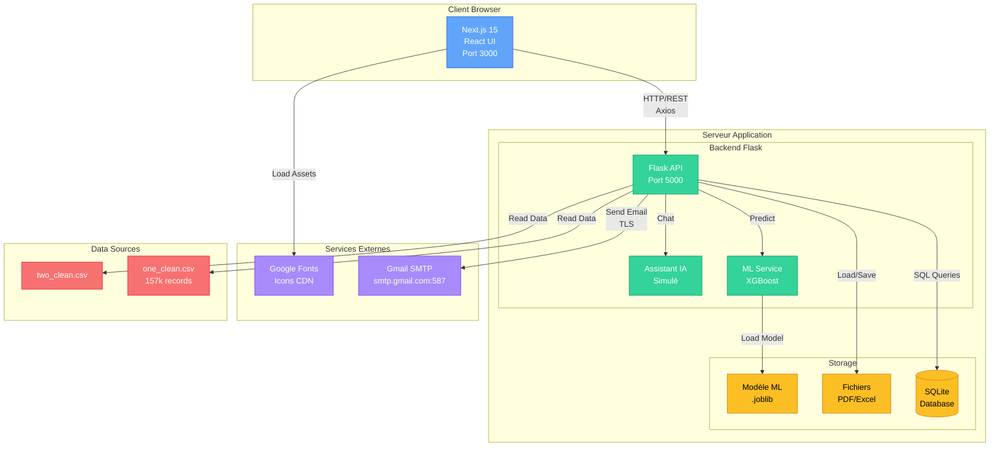

# Diagramme de Déploiement - Architecture Système

## Vue d'ensemble

Ce diagramme montre l'architecture technique et le déploiement des composants du système.

## Diagramme



## Description des Composants

### 🖥️ Client Browser
**Next.js 15 UI (Port 3000)**
- Framework React avec Turbopack
- Tailwind CSS pour le styling
- Axios pour les requêtes HTTP
- Responsive design

**Technologies:**
- Next.js 15
- React 18
- TypeScript
- Tailwind CSS

---

### 🔧 Serveur Application

**Flask API (Port 5000)**
- Backend Python
- Routes RESTful API
- Authentification JWT
- CORS activé

**Endpoints principaux:**
- `/api/predict` - Prédictions ML
- `/api/modules-futurs` - Recommandations
- `/api/alertes/test-email` - Envoi emails
- `/api/chat/message` - Assistant IA

**ML Service (XGBoost)**
- Modèle pré-entraîné
- 43 features calculées
- Précision 99.96%
- StandardScaler pour normalisation

**Assistant IA (Simulé)**
- Pattern matching intelligent
- Réponses basées sur vraies données
- Gratuit (pas d'API OpenAI)

---

### 💾 Storage

**SQLite Database**
- Utilisateurs et authentification
- Interventions pédagogiques
- Historique des prédictions
- Logs système

**Schéma:**
```sql
- users
- etudiants
- modules
- predictions
- interventions
- emails_sent
```

**Fichiers Générés**
- Rapports PDF
- Exports Excel
- Logs

**Modèle ML (.joblib)**
- XGBoost + CalibratedClassifierCV
- StandardScaler
- K-Means pour profils
- Feature columns (43)
- ~50MB

---

### 🌐 Services Externes

**Gmail SMTP**
- Serveur : smtp.gmail.com:587
- Protocole : TLS/STARTTLS
- Authentification App Password
- Envoi emails HTML professionnels

**CDN Assets**
- Google Fonts (Inter, Roboto)
- Lucide Icons
- Images statiques

---

### 📊 Data Sources

**CSV Files**
- `one_clean.csv` - 157,068 enregistrements
- `two_clean.csv` - Données additionnelles
- Encodage UTF-8
- Colonnes : ID, Major, Subject, Total, Semester, etc.

---

## Flux de Déploiement

### Développement
```
1. npm run dev (Frontend - Port 3000)
2. python app.py (Backend - Port 5000)
3. Hot reload activé des deux côtés
```

### Production
```
1. next build (Build optimisé)
2. Servir avec nginx reverse proxy
3. PM2 pour Flask
4. SSL/TLS certificat
```

---

## Communication

### Frontend ↔ Backend
- **Protocole:** HTTP/HTTPS (RESTful)
- **Format:** JSON
- **Client:** Axios avec base URL configurée
- **Timeout:** 30 secondes

### Backend ↔ Database
- **Driver:** sqlite3 Python
- **Connection:** Singleton pattern
- **Transactions:** ACID compliant

### Backend ↔ ML
- **Loading:** joblib.load() au démarrage
- **Prediction:** In-memory, très rapide
- **Cache:** Prédictions stockées en DB

---

## Sécurité

🔒 **Mesures Implémentées**
- Authentification JWT
- Passwords hashés (bcrypt)
- CORS configuré
- App Password pour Gmail (pas mot de passe principal)
- Variables d'environnement (.env)
- Validation des inputs

---

## Performance

⚡ **Optimisations**
- Next.js Turbopack (build rapide)
- API responses cachées
- Modèle ML chargé une seule fois
- Échantillon limité pour SHAP/LIME
- Compression images (WebP)

---

## Scalabilité

📈 **Design Scalable**
- API stateless (peut être répliquée)
- SQLite → PostgreSQL migration possible
- Peut ajouter Redis pour cache
- Load balancer ready
- Microservices-compatible

---

**Note:** Ce diagramme peut être visualisé sur https://mermaid.live
