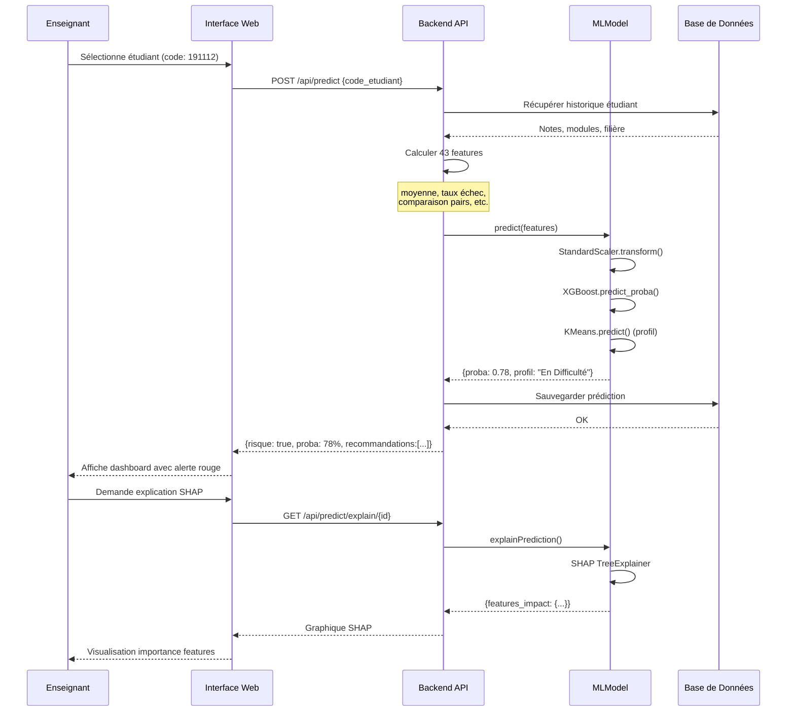
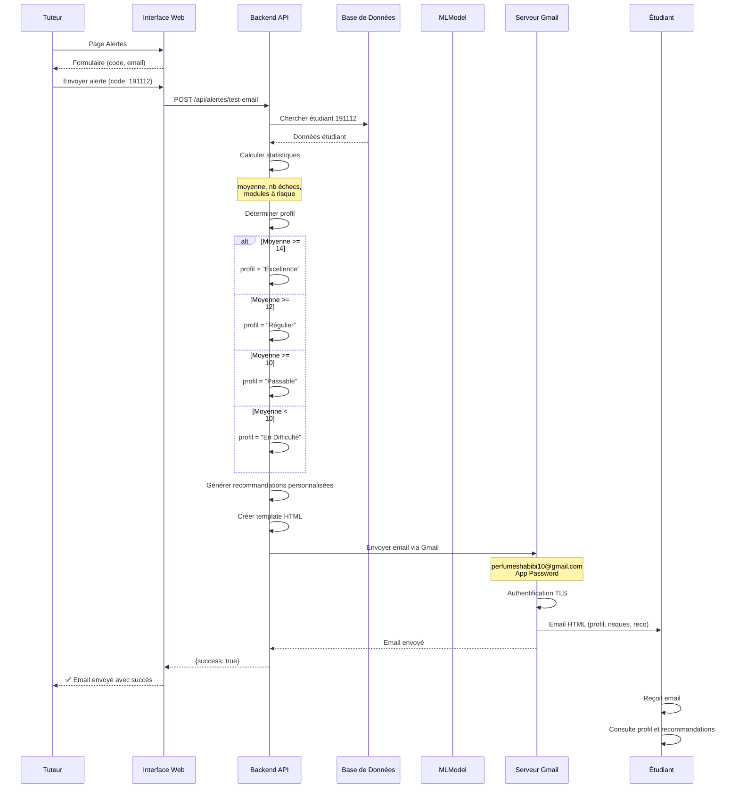
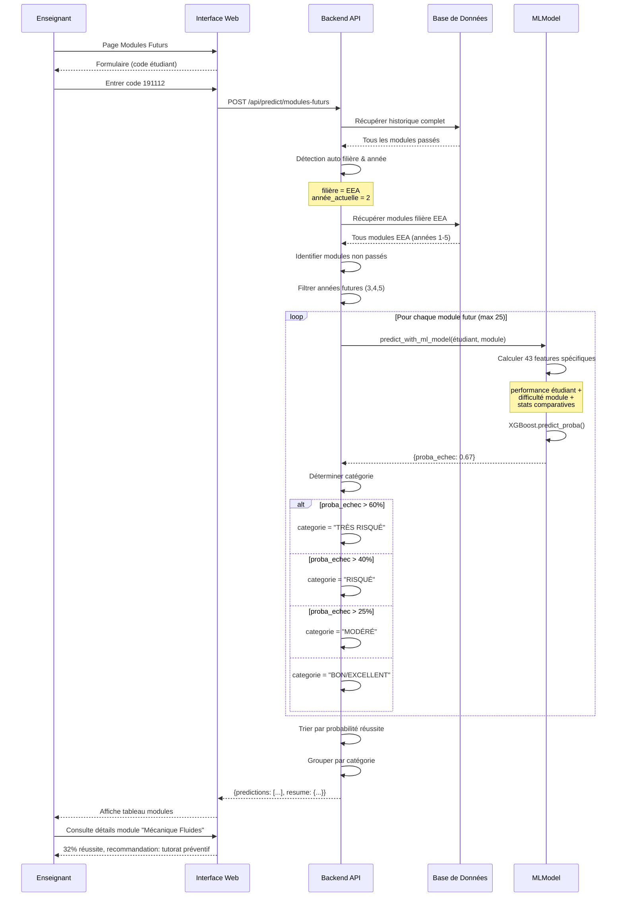
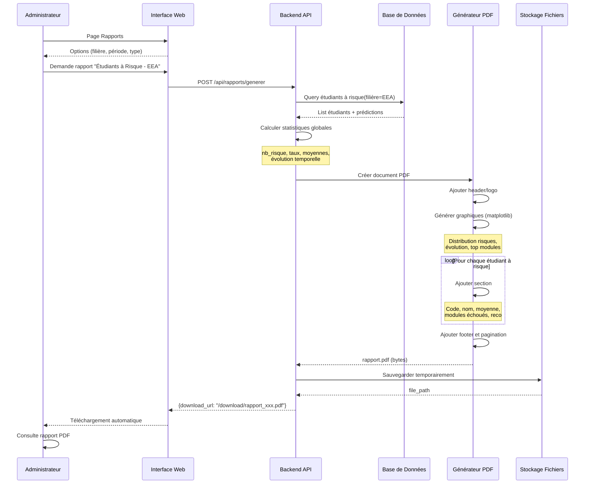
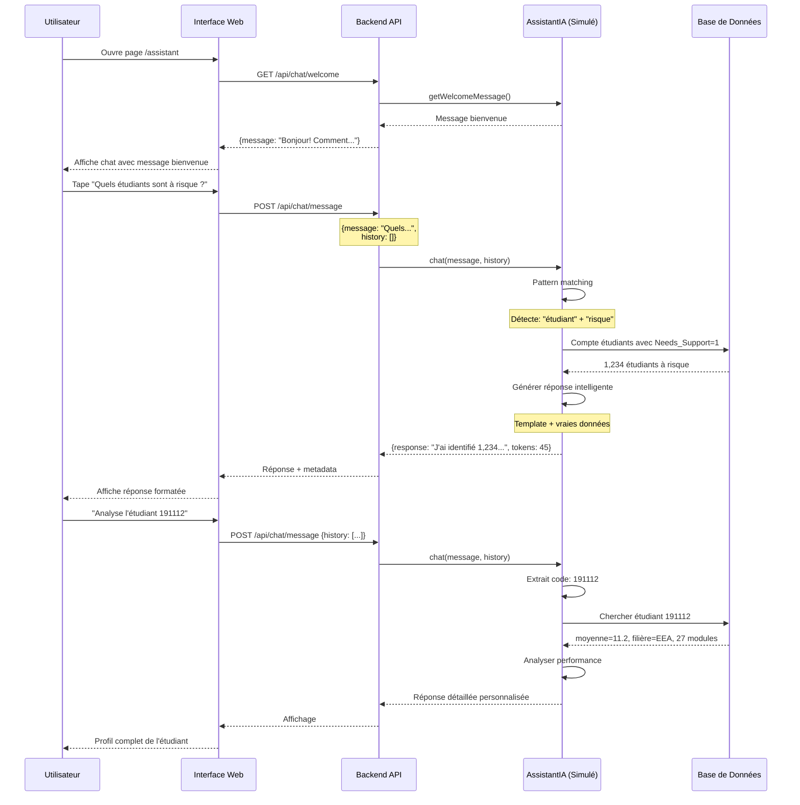

# Diagrammes de Séquence - Système de Soutien Pédagogique

## Vue d'ensemble

Ces diagrammes illustrent les flux d'interaction pour les scénarios clés du système.

---

## 1. Prédiction de Risque pour un Étudiant

---

## 2. Envoi d'Alerte Email

---

## 3. Recommandation de Modules Futurs

---

## 4. Génération de Rapport PDF

---

## 5. Utilisation de l'Assistant IA

---

## Notes d'Implémentation

### Patterns Utilisés

1. **Pattern Request-Response** : Toutes les interactions UI ↔ API
2. **Pattern MVC** : Séparation UI, API (Controller), DB (Model)
3. **Pattern Singleton** : MLModel (une instance)
4. **Pattern Strategy** : Différents générateurs (PDF, Excel)

### Technologies

- **Frontend → Backend** : Axios HTTP requests
- **Backend → Database** : SQLite avec ORM custom
- **Backend → ML** : joblib model loading
- **Backend → Email** : smtplib via Gmail
- **Backend → AI** : Pattern matching simulé

### Points Clés

- **Asynchrone** : Génération PDF en background
- **Cache** : Prédictions stockées pour éviter recalcul
- **Optimisation** : Features pré-calculées quand possible
- **Sécurité** : Authentification JWT sur toutes les routes sensibles

---

**Note:** Ces diagrammes Mermaid peuvent être visualisés sur https://mermaid.live ou intégrés dans un rapport Markdown.
