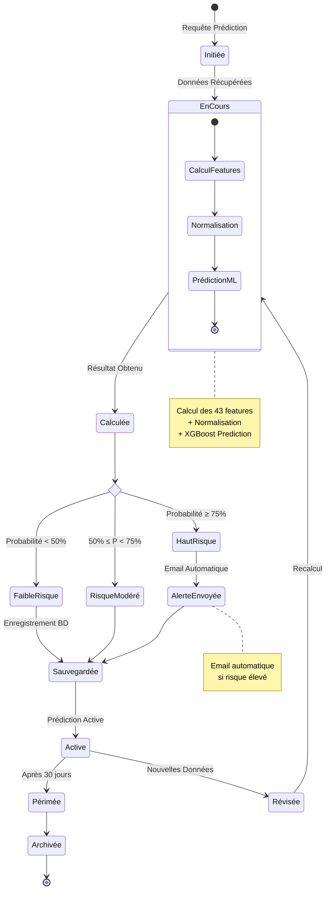
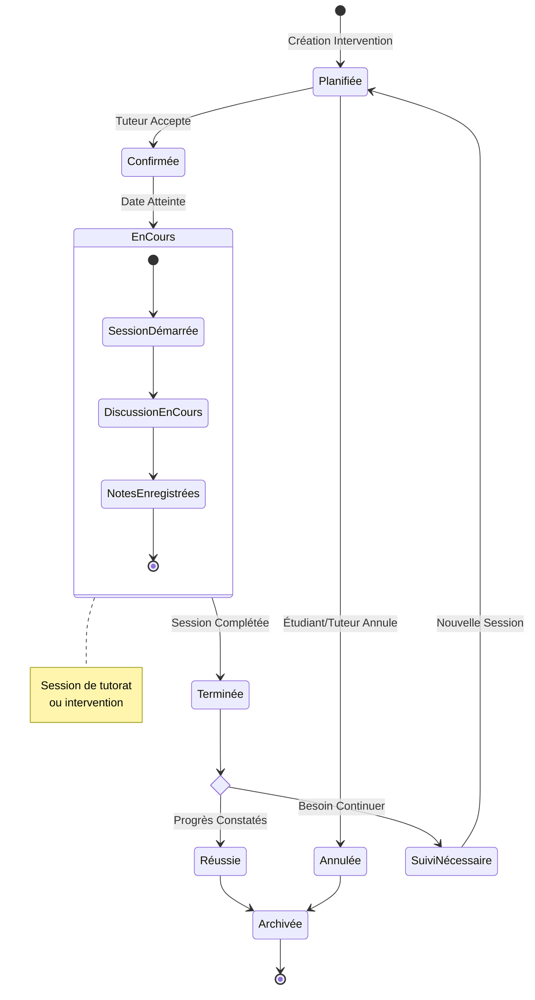
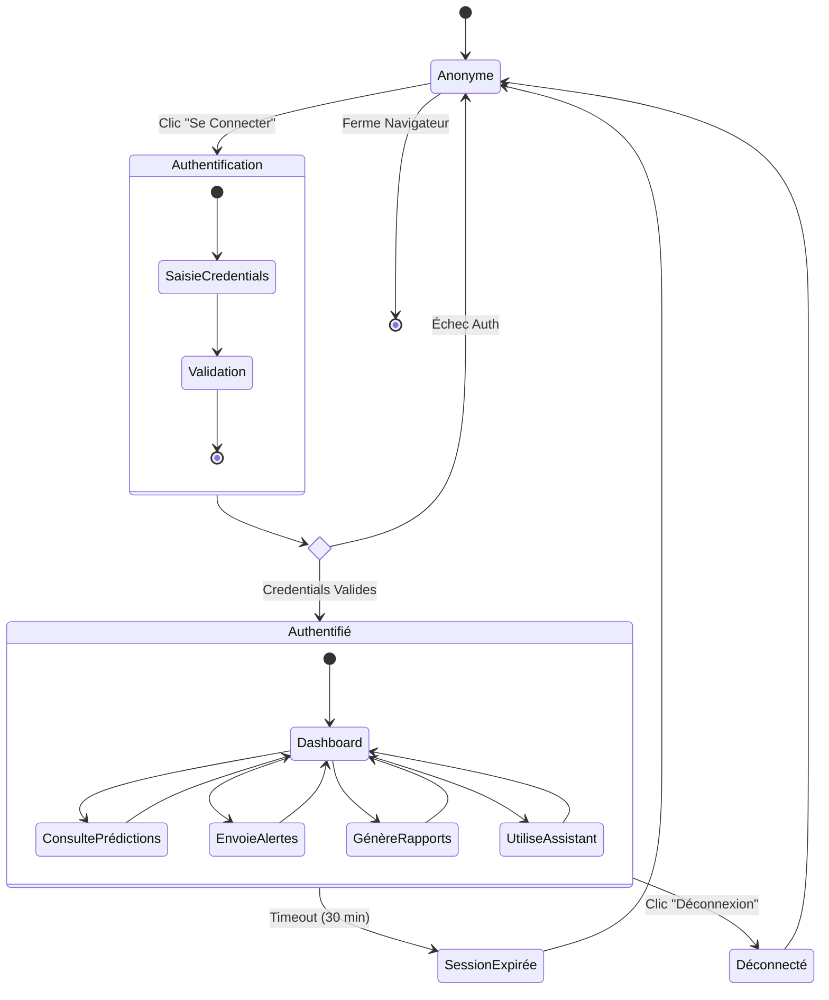
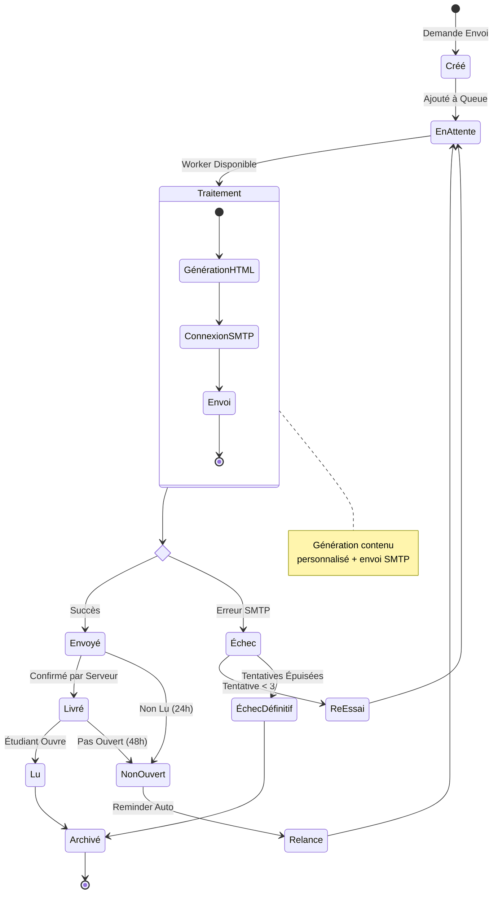

# Diagramme d'États - Cycle de Vie

## Vue d'ensemble

Ce diagramme représente les états et transitions d'une prédiction dans le système.

## Diagramme d'États: Prédiction

---

## Diagramme d'États: Intervention Pédagogique

---

## Diagramme d'États: Utilisateur (Session)

---

## Diagramme d'États: Email Alert

---

## Légende

### États

| Type | Description |
|------|-------------|
| **État Simple** | Rectangle simple |
| **État Composite** | Rectangle avec sous-états |
| **État de Choix** | Losange (condition) |
| **État Initial** | Cercle plein noir |
| **État Final** | Cercle avec contour |

### Transitions

| Notation | Signification |
|----------|---------------|
| → | Transition |
| Label | Événement déclencheur |
| [Condition] | Condition de transition |

---

## Description des États Clés

### Prédiction
- **Initiée** : Requête reçue
- **EnCours** : Calculs ML en cours
- **Calculée** : Score obtenu
- **Active** : Valide et utilisable
- **Périmée** : Plus à jour
- **Archivée** : Historique

### Intervention
- **Planifiée** : Créée mais pas confirmée
- **Confirmée** : Tuteur a accepté
- **EnCours** : Session en direct
- **Terminée** : Session complétée
- **Réussie** : Progrès observés

### Session Utilisateur
- **Anonyme** : Non connecté
- **Authentifié** : Connecté et actif
- **SessionExpirée** : Timeout atteint
- **Déconnecté** : Logout volontaire

---

## Transitions Automatiques

Certaines transitions se déclenchent automatiquement :

1. **Prédiction** : Active → Périmée (après 30 jours)
2. **Session** : Authentifié → SessionExpirée (après 30 min d'inactivité)
3. **Email** : Envoyé → NonOuvert (après 24h sans lecture)
4. **Intervention** : Confirmée → EnCours (à la date/heure prévue)

---

## Événements Métier

| Événement | Impact |
|-----------|---------|
| Nouvelles notes entrées | Prédiction Active → Révisée |
| Email bounce | Envoyé → Échec |
| Étudiant se connecte | Permet de tracker "Lu" |
| Fin de semestre | Interventions → Archivées |

---

**Note:** Ces diagrammes peuvent être visualisés sur https://mermaid.live
