# Diagramme de Cas d'Utilisation - Système de Soutien Pédagogique

## Vue d'ensemble

Ce diagramme représente les principales fonctionnalités du système selon les différents acteurs.

## Diagramme

```mermaid
graph TB
    subgraph "Système de Soutien Pédagogique"
        subgraph "Gestion Base de Données"
            UC1[Gérer Étudiants]
            UC2[Gérer Modules]
            UC3[Gérer Filières]
        end
        
        subgraph "Analyse & Prédiction"
            UC4[Prédire Risque Étudiant]
            UC5[Recommander Modules Futurs]
            UC6[Analyser Performance]
            UC7[Consulter Assistant IA]
        end
        
        subgraph "Alertes & Communication"
            UC8[Envoyer Alerte Email]
            UC9[Générer Rapport PDF]
            UC10[Exporter Données Excel]
        end
        
        subgraph "Interventions"
            UC11[Enregistrer Intervention]
            UC12[Suivre Progrès Étudiant]
            UC13[Consulter Historique]
        end
        
        subgraph "Authentification"
            UC14[Se Connecter]
            UC15[Gérer Profil]
        end
    end
    
    %% Acteurs
    Admin((Administrateur))
    Prof((Enseignant))
    Tuteur((Tuteur))
    Etudiant((Étudiant))
    Systeme((Système ML))
    
    %% Relations Administrateur
    Admin --> UC1
    Admin --> UC2
    Admin --> UC3
    Admin --> UC9
    Admin --> UC10
    Admin --> UC14
    
    %% Relations Enseignant
    Prof --> UC4
    Prof --> UC5
    Prof --> UC6
    Prof --> UC7
    Prof --> UC8
    Prof --> UC9
    Prof --> UC11
    Prof --> UC13
    Prof --> UC14
    
    %% Relations Tuteur
    Tuteur --> UC4
    Tuteur --> UC7
    Tuteur --> UC8
    Tuteur --> UC11
    Tuteur --> UC12
    Tuteur --> UC13
    Tuteur --> UC14
    
    %% Relations Étudiant
    Etudiant --> UC6
    Etudiant --> UC13
    Etudiant --> UC14
    Etudiant --> UC15
    
    %% Relations Système
    Systeme -.-> UC4
    Systeme -.-> UC5
    Systeme -.-> UC6
    
    %% Relations d'inclusion
    UC8 -. include .-> UC4
    UC9 -. include .-> UC4
    UC11 -. include .-> UC4
    UC12 -. include .-> UC11
```

## Description des Acteurs

### 👨‍💼 Administrateur
- Gestion complète du système
- Accès aux données de tous les étudiants
- Génération de rapports administratifs
- Gestion des utilisateurs

### 👨‍🏫 Enseignant
- Consultation des prédictions
- Envoi d'alertes aux étudiants
- Enregistrement d'interventions
- Génération de rapports pédagogiques

### 👤 Tuteur
- Suivi des étudiants assignés
- Consultation de l'assistant IA
- Enregistrement des sessions de tutorat
- Suivi des progrès

### 👨‍🎓 Étudiant
- Consultation de ses performances
- Visualisation de son historique
- Gestion de profil

### 🤖 Système ML
- Calcul automatique des prédictions
- Recommandations intelligentes
- Analyse de patterns

## Cas d'Utilisation Principaux

### UC4 : Prédire Risque Étudiant
**Acteurs:** Enseignant, Tuteur, Système ML  
**Description:** Utilise le modèle XGBoost pour prédire si un étudiant nécessite un soutien pédagogique  
**Préconditions:** Données étudiant disponibles  
**Postconditions:** Prédiction affichée avec niveau de confiance

### UC5 : Recommander Modules Futurs
**Acteurs:** Enseignant, Système ML  
**Description:** Recommande les modules que l'étudiant devrait prendre ou éviter  
**Préconditions:** Historique académique complet  
**Postconditions:** Liste de modules avec probabilités de réussite

### UC8 : Envoyer Alerte Email
**Acteurs:** Enseignant, Tuteur  
**Description:** Envoie un email personnalisé avec profil, risques et recommandations  
**Préconditions:** Email étudiant valide, prédiction effectuée  
**Postconditions:** Email envoyé avec succès

### UC11 : Enregistrer Intervention
**Acteurs:** Enseignant, Tuteur  
**Description:** Documente une intervention pédagogique (tutorat, conseil, etc.)  
**Préconditions:** Authentifié, étudiant sélectionné  
**Postconditions:** Intervention enregistrée en base

## Relations

- **Include** : Dépendance obligatoire (ex: Envoyer Alerte nécessite Prédire Risque)
- **Association** : Interaction entre acteur et cas d'utilisation
- **Acteur‧ ‧‧> Système** : Le système ML agit automatiquement

---

**Note:** Ce diagramme peut être visualisé avec Mermaid Live Editor ou intégré directement dans le rapport Markdown.
